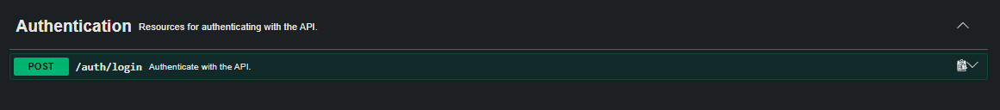
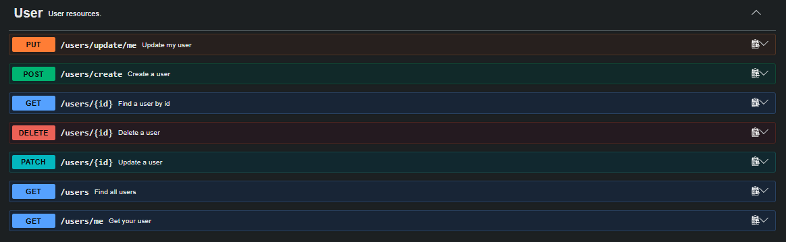
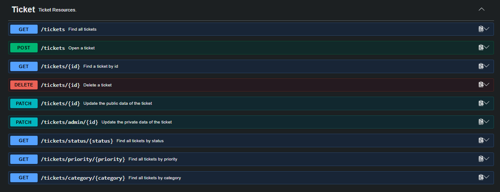

# 🛠️ Help Desk API

API REST para gerenciamento de chamados de suporte de TI, desenvolvida com **Java e Spring Boot**.

O projeto simula o backend de um sistema de Help Desk, permitindo o gerenciamento de usuários e chamados, além de autenticação, autorização por perfil, validação de dados, tratamento de exceções, testes automatizados e documentação da API.

O projeto foi desenvolvido com foco na aplicação prática de conceitos de desenvolvimento backend e na construção de uma API organizada, segura e testável.

---

## 📌 Sobre o projeto

A **Help Desk API** permite que usuários registrem chamados de suporte de TI e acompanhem seu atendimento.

Os chamados podem ser classificados por:

* Categoria;
* Prioridade;
* Status;
* Usuário solicitante;
* Profissional responsável pelo atendimento.

A API possui diferentes níveis de acesso, permitindo aplicar regras específicas para **usuários, suporte e administradores**.

---

## 🎯 Objetivos

Este projeto foi desenvolvido para praticar e consolidar conhecimentos em:

* Desenvolvimento de APIs REST;
* Java e Spring Boot;
* Arquitetura em camadas;
* Persistência de dados com JPA/Hibernate;
* Relacionamento entre entidades;
* Validação de dados;
* Tratamento global de exceções;
* Autenticação e autorização;
* JWT;
* Criptografia assimétrica com RSA;
* Controle de acesso baseado em roles;
* Testes automatizados;
* Documentação de APIs.

---

## 🚀 Funcionalidades

### 👤 Usuários

* Cadastro de usuários;
* Consulta de usuários;
* Atualização de dados;
* Gerenciamento de usuários;
* Validação dos dados recebidos;
* Controle de acesso aos recursos do usuário.

### 🎫 Chamados

* Criação de chamados;
* Consulta de chamados;
* Consulta por identificador;
* Consulta por prioridade;
* Atualização de chamados;
* Alteração de prioridade;
* Alteração de status;
* Atribuição de chamado a profissional de suporte;
* Controle do usuário solicitante;
* Regras de negócio para atualização dos chamados.

### 🔐 Autenticação e autorização

* Login de usuários;
* Autenticação utilizando JWT;
* Assinatura dos tokens utilizando RSA;
* Senhas protegidas com BCrypt;
* Controle de acesso baseado em roles;
* Endpoints protegidos pelo Spring Security;
* Aplicação stateless;
* Diferenciação entre:

  * `ROLE_USER`
  * `ROLE_SUPPORT`
  * `ROLE_ADMIN`

---

## 🏗️ Arquitetura

A aplicação utiliza uma arquitetura organizada em camadas:

```text
Controller
     ↓
Service
     ↓
Repository
     ↓
Database
```

O fluxo de uma requisição pode ser representado como:

```text
HTTP Request
     ↓
DTO
     ↓
Validation
     ↓
Controller
     ↓
Service
     ↓
Repository
     ↓
PostgreSQL
```

### Principais responsabilidades

**Controller**

Responsável por receber as requisições HTTP e retornar as respostas da API.

**Service**

Concentra as regras de negócio da aplicação.

**Repository**

Responsável pelo acesso e persistência dos dados utilizando Spring Data JPA.

**DTO**

Define os dados que entram e saem da API, evitando expor diretamente as entidades em todas as operações.

**Security**

Responsável pela autenticação, autorização e validação dos tokens JWT.

**Exception Handler**

Centraliza o tratamento das exceções da aplicação através de `RestControllerAdvice`.

---

## 🛠️ Tecnologias utilizadas

| Tecnologia        | Utilização                     |
| ----------------- | ------------------------------ |
| Java 21           | Linguagem de programação       |
| Spring Boot       | Desenvolvimento da API         |
| Spring Security   | Autenticação e autorização     |
| JWT               | Autenticação baseada em tokens |
| RSA               | Assinatura dos tokens          |
| Spring Data JPA   | Persistência de dados          |
| Hibernate         | ORM                            |
| PostgreSQL        | Banco de dados                 |
| Maven             | Gerenciamento de dependências  |
| BCrypt            | Criptografia de senhas         |
| JUnit             | Testes automatizados           |
| Mockito           | Testes unitários               |
| MockMvc           | Testes de integração           |
| Swagger / OpenAPI | Documentação da API            |

---

## 🔐 Segurança

A API utiliza autenticação baseada em **JWT (JSON Web Token)**.

O fluxo de autenticação funciona da seguinte forma:

```text
Usuário
   ↓
POST /auth/login
   ↓
Spring Security
   ↓
Validação de email e senha
   ↓
JWT
   ↓
Authorization: Bearer <token>
   ↓
Endpoint protegido
```

Os tokens são assinados utilizando um par de chaves RSA:

* Chave privada: utilizada para assinar o token;
* Chave pública: utilizada para validar o token.

As credenciais e chaves utilizadas pela aplicação **não ficam armazenadas diretamente no código-fonte**. Elas são fornecidas através de variáveis de ambiente.

---

## 🧪 Testes

O projeto possui testes automatizados para verificar o comportamento da aplicação em diferentes níveis.

### Testes unitários

Utilização de:

* JUnit;
* Mockito.

### Testes de integração

Utilização de:

* Spring Boot Test;
* MockMvc.

Também foram realizados testes envolvendo:

* Controllers;
* Autenticação;
* JWT;
* Endpoints protegidos;
* Regras de acesso;
* Requisições HTTP;
* Validação das respostas da API.

---

## 📖 Documentação da API

A API possui documentação interativa utilizando **Swagger/OpenAPI**.

Através do Swagger é possível:

* Visualizar os endpoints;
* Consultar parâmetros;
* Visualizar modelos de requisição e resposta;
* Realizar requisições;
* Testar endpoints protegidos utilizando JWT.

### Swagger

Após executar a aplicação localmente:

```text
http://localhost:8080/swagger-ui.html
```

ou:

```text
http://localhost:8080/swagger-ui/index.html
```

---

## 📡 Principais endpoints

### Autenticação

```http
POST /auth/login
```


Responsável pela autenticação do usuário e geração do JWT.

### Usuários

```http
POST   /users/create
GET    /users/...
PUT    /users/...
```


### Chamados

```http
POST   /tickets/...
GET    /tickets/...
PUT    /tickets/...
```


> Os endpoints e permissões completas podem ser consultados através da documentação Swagger.

---

## ⚙️ Configuração e execução

### Pré-requisitos

Antes de executar o projeto, é necessário possuir:

* Java 21;
* Maven;
* PostgreSQL;
* Git.

### 1. Clone o repositório

```bash
git clone https://github.com/mar1a-ed/T.I-Help-Desk.git
```

### 2. Entre na pasta do projeto

```bash
cd T.I-Help-Desk
```

### 3. Configure as variáveis de ambiente

A aplicação utiliza as seguintes variáveis:

```text
DB_URL
DB_USERNAME
DB_PASSWORD
JWT_PUBLIC_KEY
JWT_PRIVATE_KEY
```

Exemplo:

```text
DB_URL=jdbc:mysql://localhost:3306/help_desk
DB_USERNAME=root
DB_PASSWORD=sua_senha
JWT_PUBLIC_KEY=sua_chave_publica
JWT_PRIVATE_KEY=sua_chave_privada
```

> **Importante:** não compartilhe ou versione senhas e chaves privadas no repositório.

### 4. Execute a aplicação

Utilizando Maven:

```bash
./mvnw spring-boot:run
```

No Windows:

```bash
mvnw.cmd spring-boot:run
```

A API estará disponível em:

```text
http://localhost:8080
```

---

## 🗄️ Banco de dados

O projeto utiliza **MySQL** como banco de dados e **JPA/Hibernate** para o mapeamento objeto-relacional.

As entidades da aplicação são persistidas no banco através do Spring Data JPA.

A configuração da conexão é realizada através de variáveis de ambiente, evitando o armazenamento de credenciais diretamente no código-fonte.

---

## 📋 Modelo de dados

O sistema possui como principais entidades:

```text
User
  │
  └──────────< Ticket
                  │
                  └────────── Support
```

Os chamados possuem informações como:

* Título;
* Descrição;
* Categoria;
* Prioridade;
* Status;
* Data de solicitação;
* Data de atualização;
* Usuário solicitante;
* Profissional responsável pelo atendimento.

---

## 📚 Conceitos aplicados

Este projeto reúne diversos conceitos estudados durante o desenvolvimento backend:

* Programação orientada a objetos;
* APIs REST;
* HTTP;
* DTOs;
* Mapeamento objeto-relacional;
* JPA;
* Hibernate;
* Spring Data;
* Injeção de dependências;
* Validação;
* Tratamento de exceções;
* Autenticação;
* Autorização;
* JWT;
* RSA;
* BCrypt;
* Testes unitários;
* Testes de integração;
* Documentação de APIs;
* Variáveis de ambiente;
* Boas práticas de organização de código.

---

## 🚀 Deploy

A aplicação está preparada para ser executada utilizando configurações externas através de variáveis de ambiente.

Em ambiente de produção, as seguintes informações devem ser configuradas no serviço de hospedagem:

```text
DB_URL
DB_USERNAME
DB_PASSWORD
JWT_PUBLIC_KEY
JWT_PRIVATE_KEY
```

As credenciais e chaves privadas não devem ser armazenadas no código-fonte ou no repositório público.

---

## 📌 Próximos passos

Algumas possibilidades de evolução para o projeto:

* Implementação de paginação e ordenação;
* Filtros avançados para chamados;
* Sistema de notificações;
* Histórico de alterações dos chamados;
* Upload de arquivos e anexos;
* Métricas e monitoramento;
* Containerização com Docker;
* Pipeline de CI/CD.

---

## 👩‍💻 Autora

**Maria Eduarda**

Projeto desenvolvido como parte do meu processo de aprendizado e prática em desenvolvimento backend com Java e Spring Boot.
